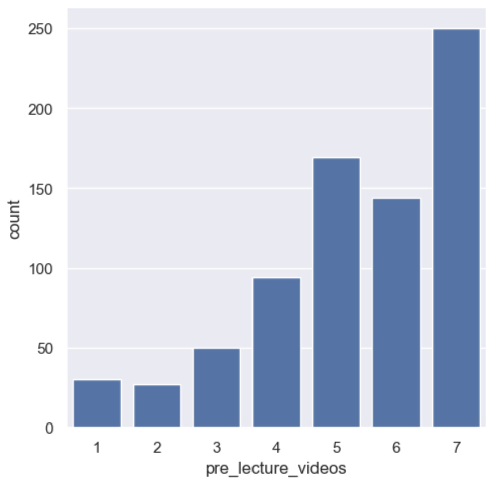
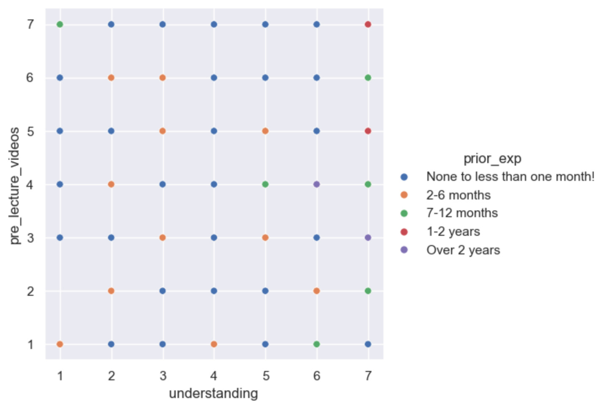
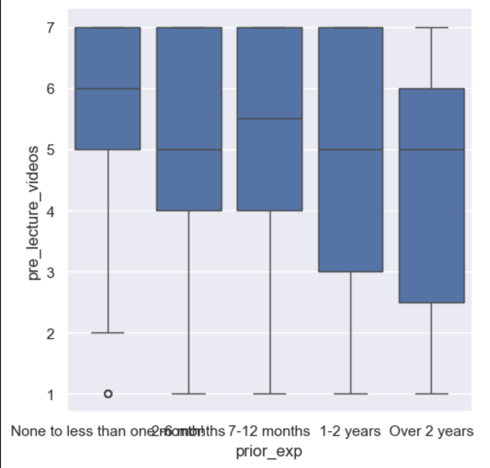

# Pre-Lecture Videos Analysis

## Summary
This analysis explored whether COMP110 students would benefit from optional pre-lecture videos, using anonymized survey data collected earlier in the semester.

## Analysis
We examined student ratings of pre-lecture videos alongside their self-reported understanding scores and prior programming experience. After filtering out incomplete responses, we had 764 rows of data to analyze.

## Chart 1: Distribution of Ratings

## Chart 2: Understanding vs Interest

## Chart 3: Interest by Experience Level

## Conclusion
Most students rated pre-lecture videos highly, suggesting strong interest. Students with lower self-reported understanding tended to rate them more favorably. Even students with prior experience showed high interest, indicating broad appeal.

A potential trade-off is the production cost and staff time required. As future work, the course could pilot pre-lecture videos for one unit and survey students afterward to see if they felt more prepared.
